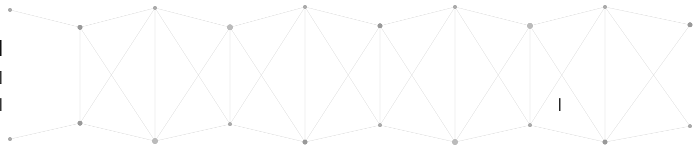

  

*Last updated:* `2026-04-17`

  

- Computer Science graduate based in Sweden
- I work across cybersecurity, AI and machine learning, computer vision, backend systems, cloud deployment and full stack development
- I also do freelancing where I build portfolio websites and software solutions for clients
- Portfolio: [ahmedmahfoozalikhan.me](https://www.ahmedmahfoozalikhan.me/)
- Steganography Paper: [A Steganographic Approach for Medical Imaging](https://www.ahmedmahfoozalikhan.me/projects/cyber-security/steganography-medical-imaging)
- Thesis: [AI-driven Optimization Framework for Construction Site Ecosystems](https://urn.kb.se/resolve?urn=urn:nbn:se:bth-28884)
- Reach me at **ahmedmahfooz2me@gmail.com**
- Ask me about **Cybersecurity, AI and ML, Full Stack Development, Cloud, RAG, Automation and Hugging Face**

<h3 align="left">Connect with me:</h3>

  
  &nbsp;
  

<h3 align="left">About Me:</h3>

I am a Computer Science graduate with hands on experience across cybersecurity, AI and machine learning, backend systems, cloud deployment and full stack development. I build practical systems that improve workflows, support better decision making and solve real problems. My work ranges from AI research and RAG-based applications to multimodal systems, deployment pipelines and freelance client projects.

<h3 align="left">Experience Highlights:</h3>
<ul>
  <li><b>AI Master Thesis at Volvo Construction Equipment</b> 
  Built a multimodal AI framework using RAG, PostgreSQL, FAISS and guided workflows to reduce downtime by 20%, improve diagnostic accuracy by 34% and reduce technician intervention by 27%.</li>
  <li><b>Artificial Intelligence Internship at PwC</b> 
  Developed Python classification models and data-driven solutions that improved decision accuracy by 30%.</li>
  <li><b>Cyber Security Internship at Entersoft Labs</b> 
  Worked on web application testing, SIEM monitoring, firewall and IDS/IPS configuration and network traffic analysis.</li>
  <li><b>Full Stack Web Development Internship at IIT Kanpur</b> 
  Built APIs with Node.js, Express.js and MongoDB, deployed containerized applications and improved application reliability and performance.</li>
  <li><b>Freelancing</b> 
  Designed and developed portfolio websites and software solutions for clients turning ideas into polished and usable products.</li>
</ul>

<h3 align="left">Languages and Tools:</h3>

  &nbsp;
  &nbsp;
  &nbsp;
  &nbsp;
  &nbsp;
  &nbsp;
  &nbsp;
  &nbsp;
  &nbsp;
  &nbsp;
  &nbsp;
  &nbsp;
  &nbsp;
  &nbsp;
  &nbsp;
  &nbsp;
  &nbsp;
  &nbsp;
  &nbsp;
  &nbsp;
  &nbsp;
  &nbsp;
  &nbsp;
  

<h3 align="left">Core Areas:</h3>
<ul>
  <li>Cybersecurity</li>
  <li>Artificial Intelligence and Machine Learning</li>
  <li>Retrieval-Augmented Generation</li>
  <li>Computer Vision</li>
  <li>Full Stack Development</li>
  <li>Cloud Deployment and CI/CD</li>
  <li>Freelance Web Development</li>
</ul>

<h3 align="left">Featured Projects:</h3>
<ul>
  <li><b>Swedish Marketplace</b> - Next.js 16, FastAPI, Docker, Azure</li>
  <li><b>AR Gesture Controlled Threat Shooter</b> - MediaPipe, OpenCV</li>
  <li><b>Auto Apply Sweden</b> - Python, Playwright, SQLite, APIs</li>
  <li><b>Teacher-Student Knowledge Distillation</b> - TensorFlow, Keras</li>
  <li><b>Character Encoding and Image Decoding</b> - PyTesseract, PIL, PyTorch</li>
  <li><b>Securing IoT Data</b> - Blockchain, STRIDE, SHA256</li>
</ul>

&nbsp;

